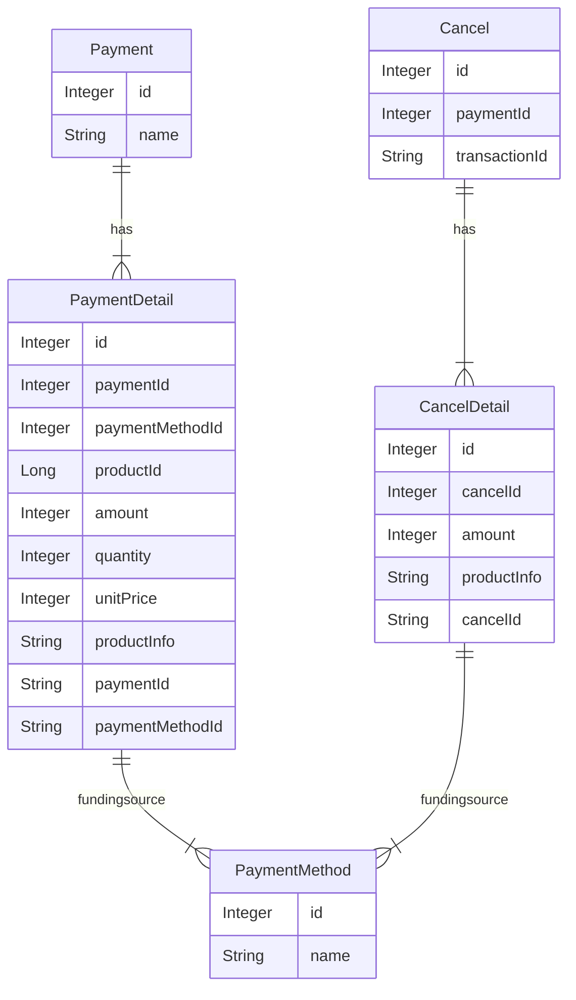
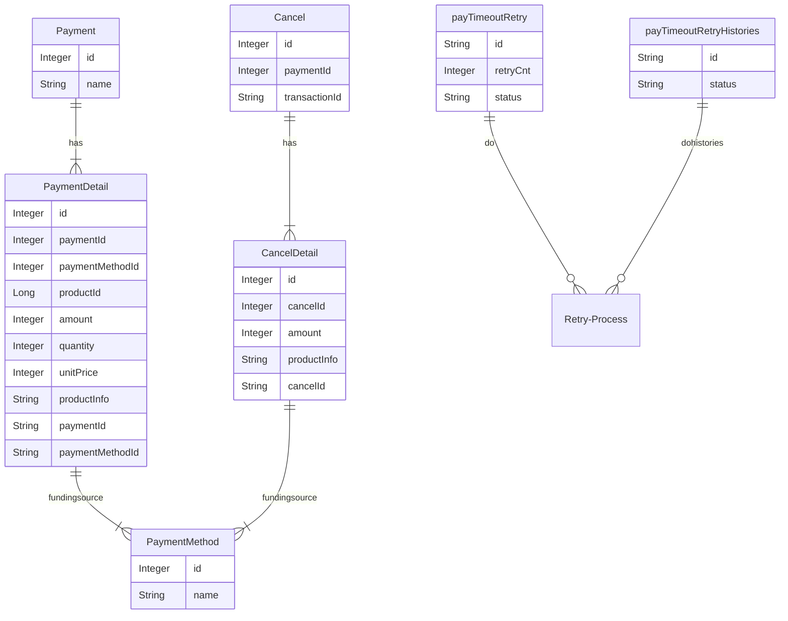

# 🪴 career-WBS
> mermaid로 작성된 과제는 마크다운 파일(WBS.md)로 올려주시면 됩니다. (md 파일 내에 기존 구조를 넣어주세요)  
> 별도 아키택쳐나 모델링 도구를 사용한 경우에는 마크다운 파일(WBS.md)과 png, gif, jpg, pdf 파일 형식으로 WBS-{gitID}.png 파일명으로 upload 해주세요
# 요구사항
- [ ] 개선하려는 프로젝트의 최종 설계
    - [ ] 변경 사항에 대한 Target 시스템 설계를 확정한다. (2주차 미션 활용)
    - [ ] 변경 사항에 대한 기대효과를 확정한다. (2주차 미션 활용)
- [ ] task list 도출
    - [ ] 현 시스템에서 변경되는 부분을 class diagram(DB변경이 발생할 경우 ERD추가)으로 작성
    - [ ] 변경, 추가 될 프로그램들의 작업 목록을 작성한다.
- [ ] 일정 계획 문서 (WBS)
  - [ ] 작업목록의 소요일정을 산정 한다.
  - [ ] 작업 목록의 의존성을 정의 한다.
  - [ ] 작업 목록의 전체 일정을 작성한다.
  - [ ] 진행 상태를 check하기위한 마일스톤 설정 한다.

# 🚀미션
## AS-IS
### AS-IS 개선포인트 분석
- 매일 전날의 결제 데이터중 timeout이 발생한 결제 건에 대한 리포트를 받아서 해당건을 확인 하고 있다.
- timeout이 발생하였을 경우 해당 건이 PG에서 결제가 되엇는지 안되엇는지? 알수 없기 때문에 해당 승인건의 key를 pg사의 관리자 페이지에서 하나하나 확인 한다.
- 승인되었다면 해당 건을 취소하고 운영DB에 결제 실패로 수기 처리한다.
- 승인이 되지 않았다면 운영DB에 결제 실패로 수기 처리한다.
- 매일 timeout건을 확인하고 처리하는데 하루 2시간씩 고정적인 비용이 발생하고 있다. 
 
### AS-IS 프로세스

```mermaid
flowchart TB
    A[Start] --주문요청--> B(승인)
    B --> C{PG요청}
    C -- Success --> D[주문완료]
    C -- Fail --> E[결제취소]
    C -- Timeout --> F[데이터보정]
```

### Class diagram
- AS-IS 구조에서 개선을 할때 영향을 받게되는 class diagram을 작성한다.

```mermaid
classDiagram 

    class PaymentMethod {
        +String paymentMethodID
        pay()
        cancel()
    }
    PaymentMethod <|-- Card
    PaymentMethod <|-- Bank

    class PG {
        +String pgID
        pay()
        cancel()
    }
    PG <|-- Card
    PG <|-- Bank


    class Payment {
        +String paymentID
        +String transactionID
        void pay()
    }

    class Cancel {
        +String cancelID
        +PaymentID paymentID
        +String transactionID
        void cancel()
    }

    class CancelDetail {
        +String cancelDetailID
        +String cancelID
    }

    class PaymentDetail {
        +PaymentID paymentID
    }


    class Card {
        CardID
        pay()
        cancel()
        checkTransaction()
    }
    note for Card "checkTransaction() : 결제내역확인"

    class Bank {
        BankID
        pay()
        cancel()
        checkTransaction()
    }
    note for Bank "checkTransaction() : 결제내역확인"

   Payment "1" -- "*" PaymentDetail : 결제수단, 금액, 상품 정보
   Cancel "1" -- "*" CancelDetail : 결제수단, 금액, 상품 정보
   Cancel "0..1" --> "1" Payment : 원결제 정보
   Payment --> PaymentMethod : 결제요청
   Cancel --> PaymentMethod : 취소요청


```

### ERD
-AS-IS 구조에서 개선을 할때 영향을 받게되는 ERD를 작성한다.

## TO-BE 
### TO-BE 기대효과 분석
- timeout 건을 처리하는데 매일 소요되는 2시간의 업무 시간을 30분 내외로 줄일 수 있다.
- 사람이 직접 하는 부분을 자동화 하여 실수를 줄일 수 있다.
    - 가끔 결제가 되었는데 timeout건으로 나왔으나 수기처리시 누락된 경우 고객의 CS 클래임이 인입되고 좋지않은 고객경험을 준다.
    - timeout 갤제 CS인입건 1건/week 을 0건으로 줄일 수 있다.
- 익일 처리되던 프로세스를 5분단위의 batch로 처리하여서 고객만족을 줄 수 있다.
    - 주문은 실패 했지만 결제가 되었다는 CS 건 3건/week를 0건으로 줄일 수 있다.
 
### TO-BE 프로세스

```mermaid
flowchart TB
 G[Start] --주문요청 --> H(승인)
    H --> I(PG요청)
    I -- Success --> J[주문완료]
    I -- Fail --> K[결제취소]
    I -- Timeout --> L[재처리]
    L -- 승인확인 --> M(PG)
    M -- 결제실패 --> Z(완료)
    M -- 결제성공 --> O(승인취소)
    O --> Z

```

### class diagram
- class diagram

```mermaid
classDiagram

    class PaymentMethod {
        +String paymentMethodID
        pay()
        cancel()
    }
    PaymentMethod <|-- Card
    PaymentMethod <|-- Bank

    class PG {
        +String pgID
        pay()
        cancel()
    }
    PG <|-- Card
    PG <|-- Bank


    class Payment {
        +String paymentID
        +String transactionID
        void pay()
    }

    class Cancel {
        +String cancelID
        +PaymentID paymentID
        +String transactionID
        void cancel()
    }

    class CancelDetail {
        +String cancelDetailID
        +String cancelID
    }

    class PaymentDetail {
        +PaymentID paymentID
    }


    class Card {
        CardID
        pay()
        cancel()
        checkTransaction()
    }
    note for Card "checkTransaction() : 결제내역확인"

    class Bank {
        BankID
        pay()
        cancel()
        checkTransaction()
    }
    note for Bank "checkTransaction() : 결제내역확인"

   Payment "1" -- "*" PaymentDetail : 결제수단, 금액, 상품 정보
   Cancel "1" -- "*" CancelDetail : 결제수단, 금액, 상품 정보
   Cancel "0..1" --> "1" Payment : 원결제 정보
   Payment --> PaymentMethod : 결제요청
   Cancel --> PaymentMethod : 취소요청


   class PaymentTiemoutListner {
        +beforeCancelForTimeout()
        -checkLimitRetryCount()
        -isPay()
        +cancelForTimeout()
        +postCancelForTimeout()
   }

   class timeoutResultNotification {
        sendNotification()
   }


    PaymentTiemoutListner "1" -- "1" Payment : 원결제확인
    Payment --> PaymentTiemoutListner : Timeout Event
    PaymentTiemoutListner --> PaymentMethod : cancel 처리

```

    

### ERD
- TO-BE 구조에서 변경되는 ERD를 작성한다.

1. Timeout 발생 시 Event발생 수정- SQS, SNS  
2. Timeout event subscription module 작성 
3. Timeout log table 설계, 생성 
4. Timeout 재처리 service 설개, 구현 
&nbsp; &nbsp; 1. transaction 성공여부 확인  
&nbsp; &nbsp; 2. transaction 취소 처리 하기 (결제시) 
&nbsp; &nbsp; 3. 재처리 logging(DB) : 처리 횟수(3회), 처리 내역 
5. Timeout 재처리 현황 조회 어드민 page. 
6. Timeout 재처리 실패시 메일 발송 모듈. 

일반적으로 요구사항 분석, 설계 기간이 추가 된다. 
관련 인프라가 없는 경우 인프라 구축기간이 추가된다. (infra 역활이 별도로 있을 경우 병렬로 진행)  
Batch로 할경우 batch 설정 관련 일정 추가 
마일 스톤은 프로젝트 기간에 따라 추가되며 agile방식에서는 대부분 sprint 데모 형식으로 대응한다.

민감한 모듈의 경우 검증 기간을 둔다.(혹은 Strangler pattern으로 병렬 운영 하면서 검증)  
여기서는 기존 로직으로 돌면서 Queue로 받은 내역을 남겨보고 수기작업을 했던 내역과 대사하여 이상이 없는지 확인 한다.

