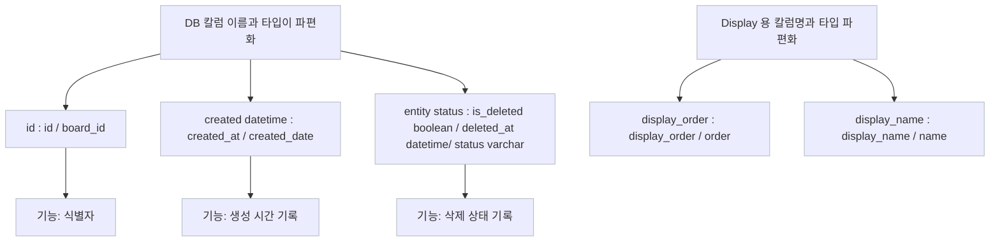
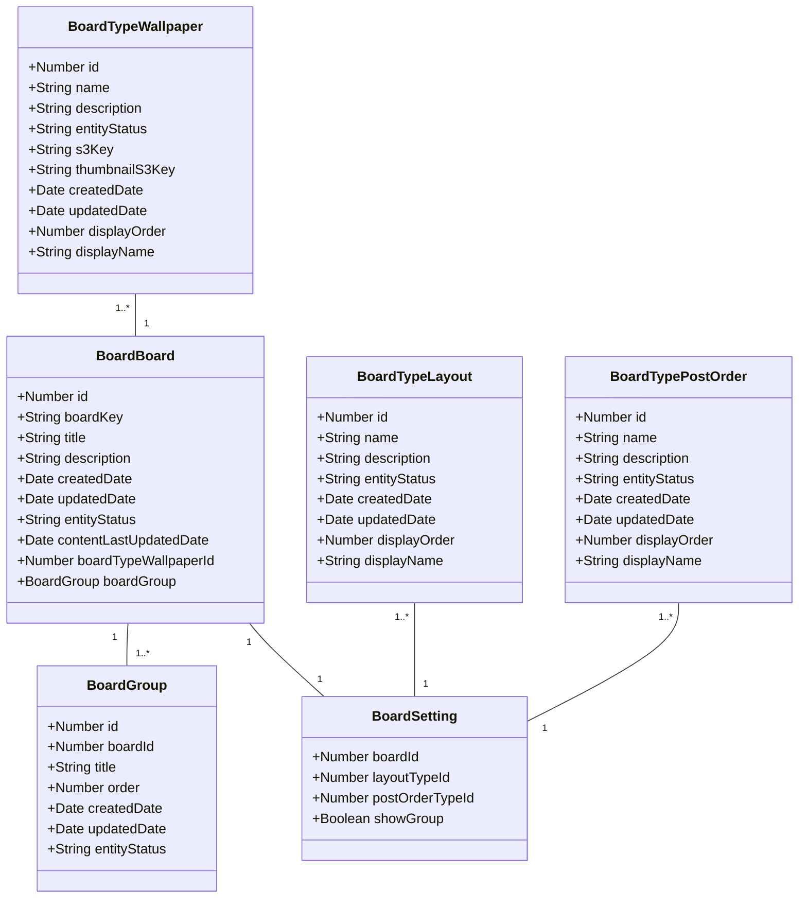
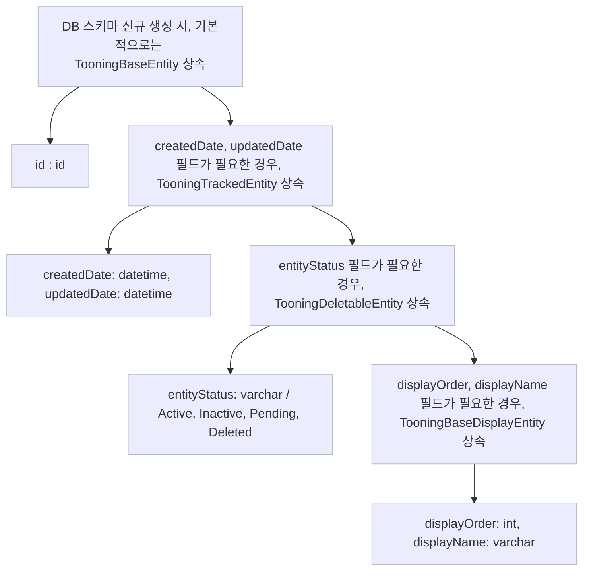
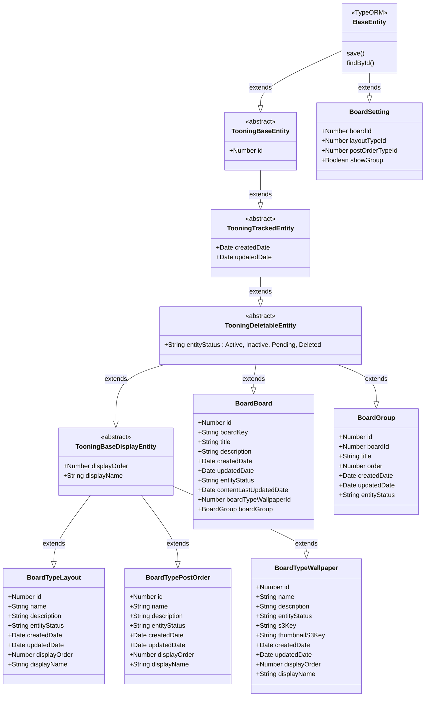
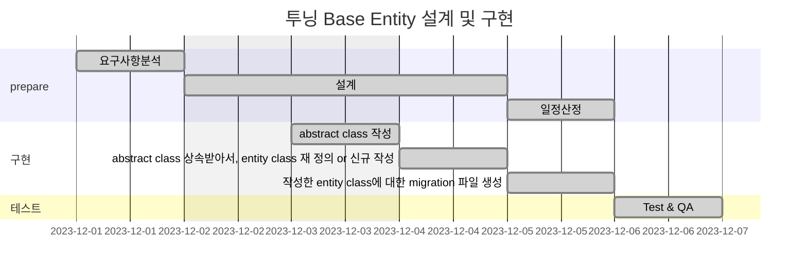

# 🪴 career-WBS

> mermaid로 작성된 과제는 마크다운 파일(WBS.md)로 올려주시면 됩니다. (md 파일 내에 기존 구조를 넣어주세요)  
> 별도 아키택쳐나 모델링 도구를 사용한 경우에는 마크다운 파일(WBS.md)과 png, gif, jpg, pdf 파일 형식으로 WBS-{gitID}.png 파일명으로 upload 해주세요

# 요구사항

- [ ] 개선하려는 프로젝트의 최종 설계
  - [ ] 변경 사항에 대한 Target 시스템 설계를 확정한다. (2주차 미션 활용)
  - [ ] 변경 사항에 대한 기대효과를 확정한다. (2주차 미션 활용)
- [ ] task list 도출
  - [ ] 현 시스템에서 변경되는 부분을 class diagram(DB변경이 발생할 경우 ERD추가)으로 작성
  - [ ] 변경, 추가 될 프로그램들의 작업 목록을 작성한다.
- [ ] 일정 계획 문서 (WBS)
  - [ ] 작업목록의 소요일정을 산정 한다.
  - [ ] 작업 목록의 의존성을 정의 한다.
  - [ ] 작업 목록의 전체 일정을 작성한다.
  - [ ] 진행 상태를 check하기위한 마일스톤 설정 한다.

# 🚀미션

## AS-IS

### 개선포인트 분석

- DB 테이블에서, 유사한 기능인데, 다르게 칼럼 명, 타입으로 사용하는 경우가 많음
  - id / board_id
  - created_at / created_date
  - is_deleted / deleted_at / status
- 이로 인해, 타 도메인 개발 지원을 가거나, 신규 입사자 온보딩 시, DB의 칼럼의 의미를 파악하는 데 어려움이 있음
- 신규로, DB 테이블 생성할 때, 매번 칼럼명, 타입을 고민하고, 맞추어야 함.
- 기존 로직 모두를 한번에 바꾸는 것은 힘들지만, 이후 신규로 생성하는 테이블 스키마의 경우, 미리 정의한 Base Entity 를 사용하면, 커뮤니케이션에서도 편리하고, 통일성을 유지할 수 있음

### 프로세스

### Class diagram

- AS-IS 구조에서 개선을 할때 영향을 받게되는 class diagram을 작성한다.

## TO-BE

### TO-BE 기대효과 분석

- 신규 테이블 생성시, Base Entity를 상속받아서, 사용하면, DB 칼럼명, 타입을 변경할 때, 편리함
- 자주 사용하는 칼럼의 경우, 용어 통일이 가능함
- entity status 와 같은 경우, abstract class 에서, deleteEntity 라는 메소드를 만들어서, 상속받아서 사용하면, 편리함

### TO-BE 프로세스

### class diagram

- class diagram

## Task List

1. abstract class 설계 - TooningBaseEntity, TooningTrackedEntity, TooningDeletableEntity, TooningBaseDisplayEntity
2. 1에서 설계한 abstract class 작성
3. 변경 가능한 범위 내에서, abstract class 상속 받아서, entity class 재 정의 or 신규 작성
4. 작성한 entity class에 대한 migration 파일 생성

## WBS

- 산정 기준 : 2시간/일

1. 요구사항 분석 : 1d
2. 설계 : 1d
3. 일정산정: 1d
4. abstract class 작성 : 0.5d
5. abstract class 상속받아서, entity class 재 정의 or 신규 작성 : 1d
6. 작성한 entity class에 대한 migration 파일 생성 : 0.5d
7. 테스트 : 0.5d

