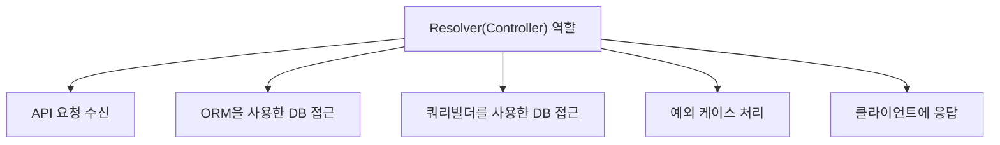
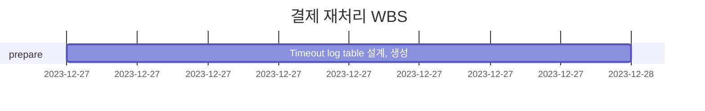

# 🪴 career-WBS

> mermaid로 작성된 과제는 마크다운 파일(WBS.md)로 올려주시면 됩니다. (md 파일 내에 기존 구조를 넣어주세요) <br>
> 별도 아키택쳐나 모델링 도구를 사용한 경우에는 마크다운 파일(WBS.md)과 png, gif, jpg, pdf 파일 형식으로 WBS-{gitID}.png 파일명으로 upload 해주세요

# 요구사항

- [ ] 개선하려는 프로젝트의 최종 설계
  - [ ] 변경 사항에 대한 Target 시스템 설계를 확정한다. (2주차 미션 활용)
  - [ ] 변경 사항에 대한 기대효과를 확정한다. (2주차 미션 활용)
- [ ] task list 도출
  - [ ] 현 시스템에서 변경되는 부분을 class diagram(DB변경이 발생할 경우 ERD추가)으로 작성
  - [ ] 변경, 추가 될 프로그램들의 작업 목록을 작성한다.
- [ ] 일정 계획 문서 (WBS)
  - [ ] 작업목록의 소요일정을 산정 한다.
  - [ ] 작업 목록의 의존성을 정의 한다.
  - [ ] 작업 목록의 전체 일정을 작성한다.
  - [ ] 진행 상태를 check하기위한 마일스톤 설정 한다.

# 🚀미션

## AS-IS

### 개선포인트 분석

- MVC 나, NestJS 와 같은 Framework 를 사용하지 않으며,Basic 한 NodeJS 백엔드 서버 구조
- MVC framework 에서, controller 역할을 하는 (Graphql 의 개념) resolver 함수가 모든 일을 처리함
  - api 요청 받고
  - ORM으로 repository or 쿼리빌더 로 DB 접근
  - 예외 케이스 처리 및 클라이언트에 응답하는 로직
  - 이 모든 코드들이, 모두 한 개의 resolver 함수에 있음 (resolver 는, Graphql 의 개념으로, MVC framework 에서, controller 역할을 함)
  - 이로 인해, resolver 함수가 너무 길어지고, 유지보수가 어려움

### 프로세스



### Class diagram

- AS-IS 구조에서 개선을 할때 영향을 받게되는 class diagram을 작성한다.

```mermaid
classDiagram
```

### ERD

-AS-IS 구조에서 개선을 할때 영향을 받게되는 ERD를 작성한다.

```mermaid
erDiagram
```

## TO-BE

### TO-BE 기대효과 분석

- 

### TO-BE 프로세스

```mermaid
flowchart TB

```

### class diagram

- class diagram

```mermaid
classDiagram
```

### ERD

- TO-BE 구조에서 변경되는 ERD를 작성한다.

```mermaid
erDiagram
```

## Task List

1. 

## WBS

- 산정 기준 : 4시간/일

1.



